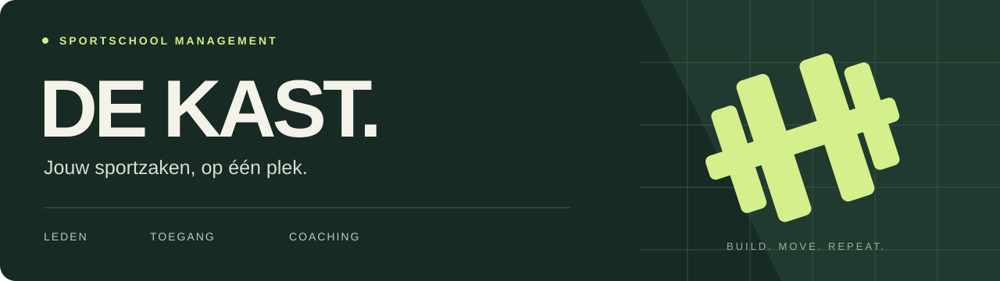

<p align="center">
  
</p>

<p align="center">
  <a href="https://github.com/LeviEeftink/Hackaton-sportschool/actions/workflows/repository.yml"></a>
  
  
  
  
</p>

<p align="center">
  <a href="https://linear.app/hackaton1levieeftink/project/sportschool-de-kast-98c7ce048137">Planning in Linear</a> ·
  <a href="docs/architecture.md">Architectuur</a> ·
  <a href="docs/roadmap.md">Roadmap</a> ·
  <a href="CONTRIBUTING.md">Meewerken</a>
</p>

# Sportschool De Kast

Een webapplicatie waarmee leden hun abonnement bekijken, inchecken en cursussen of coachafspraken boeken. Medewerkers krijgen één plek voor ledenbeheer, het sportaanbod en toegangspogingen.

Gebouwd als hackathon- en onderwijsproject met **Next.js, Payload CMS en SQLite**. De actieve sportschoolversie staat op [development](https://github.com/LeviEeftink/Hackaton-sportschool/tree/development). De branch `main` bevat de repositorybasis; het prototype wordt pas na acceptatie samengevoegd. Het project is nog niet gereed voor productie.

## Wat zit erin?

| Voor leden                                | Voor medewerkers                       |
| ----------------------------------------- | -------------------------------------- |
| Registreren, inloggen en uitloggen        | Leden en accounts beheren              |
| Abonnement en gebruikte bezoeken bekijken | Abonnementen koppelen en beëindigen    |
| Inchecken met een uitslag en reden        | Toegangspogingen raadplegen            |
| Cursusmomenten en coaches boeken          | Cursussen, momenten en coaches beheren |
| Eigen boekingen bekijken en annuleren     | Gegevens beheren via Payload Admin     |

Deze functies zijn aanwezig in het prototype. De [roadmap](docs/roadmap.md) beschrijft welke validatie, beveiliging en tests nog nodig zijn.

## Lokaal starten

Gebruik **Node.js 24** en **npm**. `package-lock.json` is het lockbestand voor installatie en CI.

```sh
git clone https://github.com/LeviEeftink/Hackaton-sportschool.git
cd Hackaton-sportschool
git switch development
npm ci
```

Kopieer `.env.example` naar `.env`:

```powershell
# PowerShell
Copy-Item .env.example .env
```

```sh
# macOS / Linux
cp .env.example .env
```

Genereer een eigen geheim en vul de uitkomst in bij `PAYLOAD_SECRET` in `.env`:

```sh
node -e "console.log(require('node:crypto').randomBytes(32).toString('hex'))"
npm run dev
```

Open [localhost:3000](http://localhost:3000). SQLite gebruikt `DATABASE_URL=file:./hackaton-1.db`. De database wordt lokaal aangemaakt; omgevingsbestanden, databases en uploads blijven buiten Git.

Maak het eerste account via `/admin` en controleer de rol in je lokale prototype. De huidige standaardrol is `lid`; de beheerinitialisatie moet nog worden aangescherpt bij HAC-24. Leg actieve abonnementen, cursussen en coaches vast om de ledenflows te proberen. De seedfunctie wist gegevens en is uitsluitend bedoeld voor een wegwerpdatabase.

### Pagina's op development

| Route         | Doel                                    |
| ------------- | --------------------------------------- |
| `/register`   | Lidaccount aanmaken                     |
| `/login`      | Inloggen                                |
| `/dashboard`  | Eigen abonnement, bezoeken en boekingen |
| `/cursussen`  | Cursusmomenten boeken                   |
| `/coaches`    | Coachafspraak plannen                   |
| `/medewerker` | Medewerkerbeheer                        |
| `/admin`      | Payload-beheeromgeving                  |

## Ontwikkelen

```sh
npm run dev                 # lokale ontwikkelserver
npm run lint                # ESLint
npm run typecheck           # zelfstandige TypeScript-controle
npm run generate:types      # Payload-types opnieuw genereren
npm run generate:importmap  # admin importmap opnieuw genereren
npm run build               # productiebuild
```

Integratie- en browsertests hebben eigen scripts: `npm run test:int` en `npm run test:e2e`. Gebruik daarvoor een afzonderlijke testdatabase. De huidige tests komen deels uit de template en dekken de sportschoolregels nog niet volledig.

**Checks:** repositoryopmaak wordt automatisch gecontroleerd. De workflow **Application diagnostics** draait lint en TypeScript op aanvraag. Het prototype bevat nog bekende fouten; een groene repositorycheck zegt niets over de werking van de app.

## Van verhaal naar code

De [Linear-planning](https://linear.app/hackaton1levieeftink/project/sportschool-de-kast-98c7ce048137) bevat **4 epics, 13 user stories en 16 implementatie- en oplevertaken**.

| Mijlpaal                      | Resultaat                                                     |
| ----------------------------- | ------------------------------------------------------------- |
| **01 · Veilige basis**        | Accounts, persoonlijke abonnementen en betrouwbare check-ins  |
| **02 · Boeken en annuleren**  | Geldige cursus- en coachboekingen met eigendomscontrole       |
| **03 · Beheer en oplevering** | Medewerkerbeheer, acceptatietests en een reproduceerbare demo |

We gebruiken drie branches: `feature` voor nieuw werk, `development` om wijzigingen samen te testen en `main` voor geaccepteerde opleveringen. De volgorde is `feature` → `development` → `main`, via pull requests. Lees de [branchafspraken](CONTRIBUTING.md).

## Projectstructuur

```text
src/
  app/(frontend)/      Pagina's en interactieve ledenflows
  app/(payload)/       Admin, REST en GraphQL
  app/api/             Eigen registratie-endpoint
  collections/         Domeinmodellen, validatie en hooks
  access/              Toegangsregels
  utilities/           Sessies en gedeelde helpers
docs/                  Architectuur, roadmap en ontwerpdiagrammen
tests/                 Vitest en Playwright
.github/               Workflows en pull-requesttemplate
```

De oorspronkelijke Pages-, Posts- en Search-template is nog deels aanwezig. De actieve Payload-configuratie op `development` gebruikt de sportschoolcollecties. Het opruimen van templateverwijzingen is nodig om de TypeScript-controle te laten slagen.

## Herkomst

Gemaakt door **Levi Eeftink** voor **Sportschool De Kast**, op basis van de [Payload Website Template](https://github.com/payloadcms/payload/tree/main/templates/website). Functioneel ontwerp: fase 1, september 2026. Zie de [ontwerp- en implementatieverschillen](docs/architecture.md).
