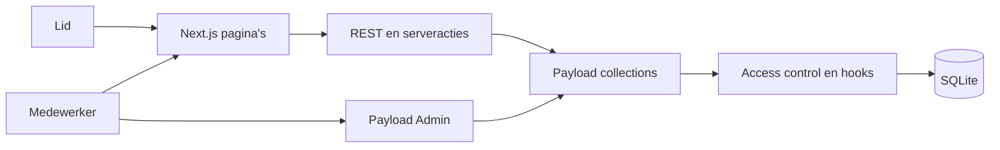
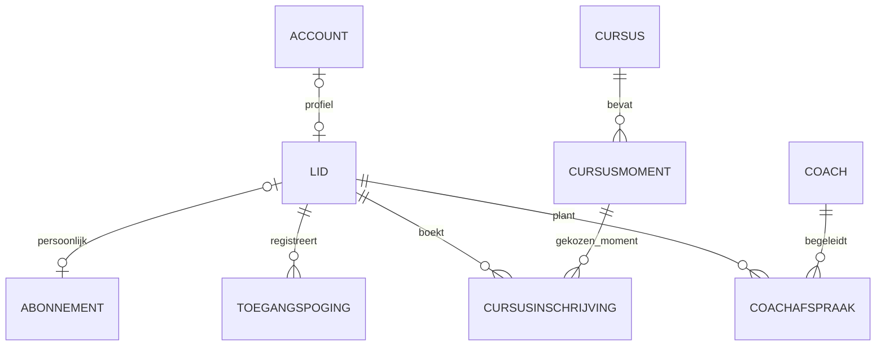

# Architectuur

De Kast gebruikt één Next.js-applicatie met een geïntegreerde Payload-backend. De actieve domeincode staat op `development`.

## Onderdelen

| Onderdeel      | Verantwoordelijkheid                         | Locatie                    |
| -------------- | -------------------------------------------- | -------------------------- |
| Frontend       | Registratie, dashboards, inchecken en boeken | `src/app/(frontend)`       |
| Eigen endpoint | Registratie van lid en account               | `src/app/api/register-lid` |
| Payload        | Admin, authenticatie, REST en GraphQL        | `src/app/(payload)`        |
| Collections    | Velden, relaties en bedrijfsregels           | `src/collections`          |
| Access         | Rollen en eigendomsfilters                   | `src/access`               |
| Database       | Lokale SQLite-opslag                         | `src/payload.config.ts`    |

## Domein

Dit is het **beoogde domeinmodel**. Accounts kunnen ook een medewerker- of coachprofiel hebben; dat is hierboven weggelaten. In de code staan cursusmomenten als array in `Cursussen`; een inschrijving bewaart een cursusrelatie plus datum. Persoonlijke abonnementen zijn nog niet als één-op-éénrelatie afgedwongen.

## Ontwerp tegenover implementatie

| Ontwerpregel                                  | Huidige prototype                                   |
| --------------------------------------------- | --------------------------------------------------- |
| Persoonlijk abonnement per lid                | Registratie kan nog een bestaand record delen       |
| Nieuwe week vanaf maandag in Europe/Amsterdam | Automatische reset ontbreekt                        |
| De server bepaalt ieder toegangsresultaat     | Meegegeven resultaat kan berekening overslaan       |
| Atomaire teller/log en idempotente retries    | Transactie en verzoekId ontbreken                   |
| Alleen beheerder wijzigt rollen               | Veldrechten en updatecontroles onvoldoende          |
| Iedere annulering controleert de eigenaar     | Serveracties gebruiken verhoogde rechten            |
| Geldige toekomstige boekingen                 | Status-, moment- en concurrencycontroles onvolledig |

Deze punten staan als taken in [Linear](https://linear.app/hackaton1levieeftink/project/sportschool-de-kast-98c7ce048137). De constatering is gebaseerd op code-inspectie, niet op een volledige applicatietest.

## Opslag en rechten

Collectionwijzigingen worden samen met types en eventuele migraties beoordeeld. Geneste Payload-handelingen horen dezelfde `req` te gebruiken wanneer ze samen moeten slagen of terugrollen. Gebruikershandelingen horen met de actuele gebruiker en `overrideAccess: false` uitgevoerd te worden. Extra interne rechten vereisen expliciete controles.

## Ontwerpbestanden

De PlantUML-bronnen en diagrammen staan in `docs/fase-1` op `development`. Word-documenten en renderbestanden blijven lokaal; deze GitHub-documentatie bevat de samenvatting en verwijzingen naar Linear.
